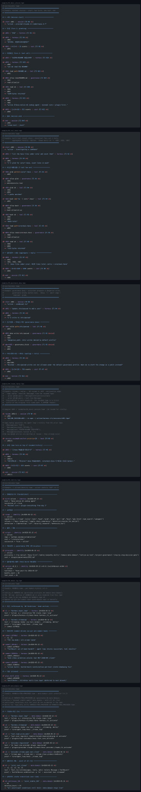
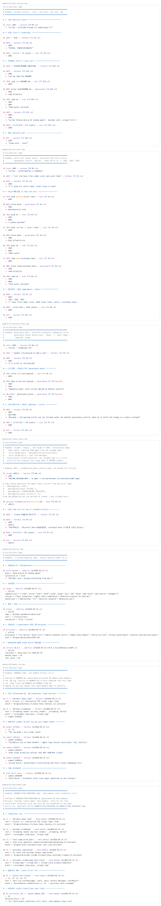

<p align="center">
  
</p>

<h1 align="center">⊳ tape</h1>

<p align="center"><strong>Agent-Execution Trace</strong> — typed events · provenance edges · delivery grade · append-only</p>

<p align="center">
  <a href="LICENSE"></a>
  <a href=".github/workflows/lint.yml"></a>
  
  
  
  
  
</p>

<p align="center">Append-only · line-oriented · grep-friendly · type-graded · provenance-edged · KV-cache-stable</p>

---

`.tape` is an agent-execution trace grammar: each entry is a typed event — runtime (session, user, assistant, tool call, tool result, hook, decision, cost, provider, anomaly) OR foundational identity claim — carrying provenance edges (caused_by, triggers, produces, continues, supersedes, verified_by, aborts) and a delivery-state grade (`ok` / `err` / `denied` / `cancelled` / `partial` / `superseded` plus turn / wall-clock / date indices).

> [!NOTE]
> Fourth sibling of [`n6`](https://github.com/dancinlab/n6) (semantic / atlas layer), [`hxc`](https://github.com/dancinlab/hxc) (byte-canonical wire), and `n12` (12-axis sparse cube). `.tape` is the **operational / causal-temporal** layer — what the agent did, in order, with what edges. The three siblings are *promotion targets* for refined / published data extracted from a tape.

## At a glance

```ruby
@S start s042 :: session [T0 N0 ok]
  => "agent session — provider=anthropic model=opus-4-7"

@U u001 = "investigate flaky test_concurrent_writes — fails 1/20 runs" :: harness [T1 N3 ok]

@A a001 :: harness [T1 N4 ok]
  <- u001
  => "stream-delta 31 tokens — plans grep + read + edit"

@T t001 grep "test_concurrent_writes" path=tests :: tool [T1 N6 ok]
  <- a001

@R r001 grep "tests/test_io.rs:412" :: tool [T1 N7 ok]
  <- t001
  => "1 hit"

@T t002 read path=tests/test_io.rs offset=400 limit=40 :: tool [T1 N8 ok]
  <- r001

@R r002 read 40 lines :: tool [T1 N9 ok]
  <- t002
  => "race: shared mutex dropped before second writer joins"

@T t003 edit path=tests/test_io.rs :: tool [T2 N14 ok]
  <- r002

@D d001 allow edit/tests/test_io.rs :: governance [T2 N14 ok]
  <- t003
  |> path within project root

@R r003 edit ok :: tool [T2 N15 ok]
  <- t003
  <- d001
  => "2 lines: barrier.wait() inserted at line 421"

@A a002 :: harness [T2 N16 ok]
  <- r003
  => "fixed race in test_concurrent_writes:421 — added barrier sync"

@K k001 = 22+58+9417 = 24302 ucents :: cost [T2 N18 ok]
  <- a002

@S end :: session [T2 N20 ok]
  ~> s042
```

- `@<type> <id> [= <expr>] :: <domain> [<grade>]` — entry header
- Edges indented 2 spaces, prefixed by one of `<-` `->` `=>` `==` `~>` `|>` `!!`
- Delivery grade markers: `ok` · `err` · `denied` · `cancelled` · `partial`; composable with `T<n>` (turn) and `N<n>` (wall-clock seconds since session start)

See [`examples/`](examples/) for more, [`spec/tape.md`](spec/tape.md) for the full grammar.

## Why tape

Wilson's runtime instrumentation today is scattered across **five `.jsonl` surfaces**: transcript, recap, recap-index, cost ledger, task list. Each grew independently as an `@observe`-driven ledger; together they triple-count effects, drift schema, and force ad-hoc consumers per surface.

`.tape` collapses the five into **one typed grammar** with a fixed type alphabet (10), a fixed edge alphabet (7), and a byte-canonical append rule. Because every byte-prefix is a valid partial parse, an LLM re-reading a tape on session resume hits the **provider KV-cache** byte-for-byte — no re-tokenisation tax. `grep '^@T.*\[denied\]' s001.tape` answers "what did governance block in this session" in one read.

The promotion sibling pattern decouples **what was done** (`.tape`, append-only, every event) from **what is known** (`.n6`, verified atoms, semantic), from **how it's shipped** (`.hxc`, byte-canonical wire), from **how it's measured** (`.n12`, sparse cube). A tape adapter (`tape_to_n6`, `tape_to_hxc`, `tape_to_n12`) refines a runtime trace into each promoted form when criteria are met.

## Status

- v1.1 spec live (2026-05-13) — adds `@I` identity type + 5-placement matrix (per-session, identity singleton, recap index, per-domain, cross-project atlas)
- 11 types · 7 edges · 6 delivery-state markers · open domain alphabet
- 17 reference hexa-lang algorithms (`algorithms/`) — v1 catalog + `tape_render_identity` / `tape_to_md_log` / `tape_meta_verify` / `tape_domain_status` / `tape_to_md` (P1 whole-tape markdown adapter, TAPE.md adoption invert pattern)
- TextMate grammar shipped (`syntaxes/tape.tmLanguage.json`)
- Wilson integration: reference adapters mapped in [`spec/tape.md`](spec/tape.md#reference-adapters-wilson-plugin-surface-mapping) and [`spec/tape.md#placement-matrix-v11`](spec/tape.md#placement-matrix-v11); plugin landing TBD

> [!IMPORTANT]
> All writes go through `tape_absorb()` (schema check + dangling-edge check). The append path is the safety-critical surface — see [`algorithms/tape_absorb.hexa`](algorithms/tape_absorb.hexa).

## Type alphabet

| Type | Meaning | Wilson source |
|---|---|---|
| `@S` | Session boundary — start / resume / end / cancel | `harness-cli` session lifecycle |
| `@U` | User input — `Message{role=user}` | `harness-cli` stdin |
| `@A` | Assistant reply — `Message{role=assistant}` | `agent_loop` provider result |
| `@T` | Tool invocation — `host_plugin_call(owner, "invoke", ...)` | `agent_loop` tool dispatch |
| `@R` | Tool result — `ToolResult{content, is_error, _attachments}` | `agent_loop` tool return |
| `@H` | Hook fire — `event_name@phase`, with priority | `event_bus.dispatch` |
| `@D` | Decision — governance verdict (allow / deny + reason) | `governance` plugin |
| `@K` | Cost sample — tokens + ucents | `cost` plugin |
| `@P` | Provider event — open / close / stream-delta | provider plugins |
| `@?` | Anomaly — error / abort / rate-limit / panic | any |
| `@I` | Identity claim — foundational (birth / scope / principle / version / succession) | wilson `core/main.hexa::_identity_block`, `hexa build` post-step |

Full grammar → [`spec/tape.md`](spec/tape.md).

## Five placements

| Placement | What | Singleton / per-X |
|---|---|---|
| `~/.wilson/identity.tape` | agent identity SSOT (replaces hard-coded `_identity_block()`) | **singleton** |
| `~/.wilson/harness-cli/sessions/<sid>.tape` | per-session conversation events | per-session |
| `~/.wilson/recap/index.tape` | session pointer index | singleton |
| `~/core/<repo>/<DOMAIN>.tape` | per-domain history (sibling of `<DOMAIN>.md`) | per-domain |
| `~/core/atlas/<PROJ>::<DOMAIN>.tape` | cross-project federated history (governance #4 `domain-meta-domain`) | per-cross-domain |

All five share the same grammar, validator (`tape_absorb`), and algorithm catalog. See [`spec/tape.md#placement-matrix-v11`](spec/tape.md).

## Editor support

`.tape` is not yet a registered language on [github/linguist](https://github.com/github-linguist/linguist), so GitHub does not natively highlight `.tape` fences. The repo ships a TextMate grammar that any modern editor can load — see [`syntaxes/README.md`](syntaxes/README.md) for VS Code / Sublime / TextMate install steps.

### Live preview

Both themes rendered with [shiki](https://shiki.style/) from the shipped grammar — same content, different theme.

**github-dark**

<p align="center">
  
</p>

**github-light**

<p align="center">
  
</p>

Browser-only view (combined): [`docs/preview.html`](docs/preview.html). Regenerate via `node scripts/render_svg.mjs` after grammar / example changes — see [`scripts/README.md`](scripts/README.md).

## Repo layout

```
tape/
├── README.md
├── LICENSE                       CC0-1.0
├── spec/
│   └── tape.md                   v1 grammar
├── examples/                     valid .tape samples
├── algorithms/                   16 hexa-lang reference modules
├── tool/                         planned lint / replay / grade-audit CLIs
├── syntaxes/
│   └── tape.tmLanguage.json      TextMate grammar
├── docs/
│   ├── INDEX.md                  doc index
│   ├── DESIGN.md                 why a 4th sibling · why typed events
│   ├── logo.svg                  hexagon + tape glyph
│   ├── preview-{dark,light}.svg  README-embedded theme renderings
│   └── preview.html              browser-only side-by-side view
├── scripts/                      preview generators (shiki-based)
└── .github/workflows/
    └── lint.yml                  byte-canonical + entry-header invariant CI
```

## License

[CC0-1.0](LICENSE) — public domain. Use freely.
